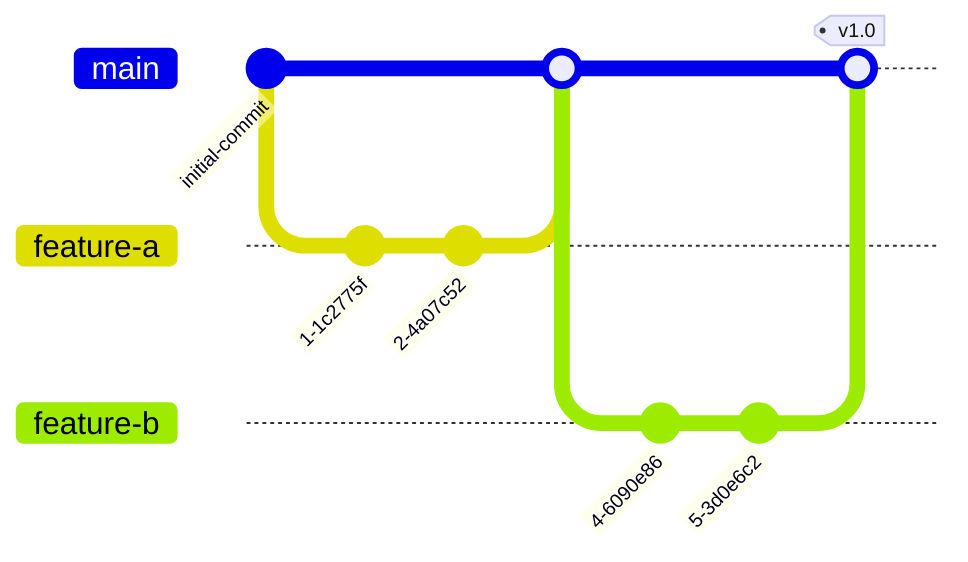
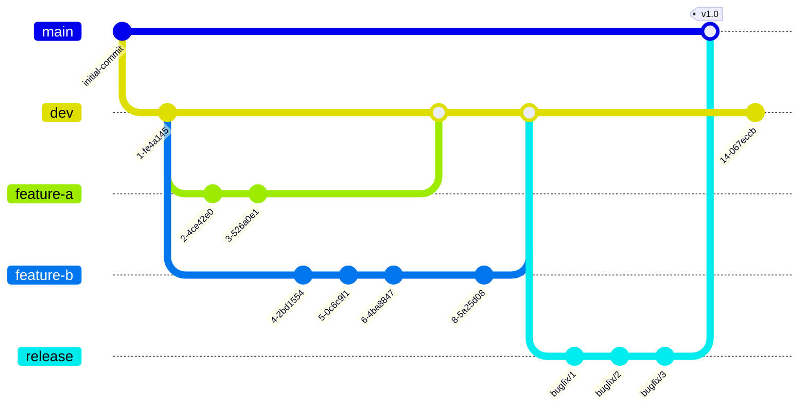

# Branching Strategies

## Table of Contents

- [Branching Strategies](#branching-strategies)
  - [Table of Contents](#table-of-contents)
  - [Purpose](#purpose)
  - [GitHub Flow (Low Complexity Projects)](#github-flow-low-complexity-projects)
    - [Workflow](#workflow)
    - [Pros](#pros)
    - [Cons](#cons)
  - [GitFlow (Medium Complexity Projects)](#gitflow-medium-complexity-projects)
    - [Workflow](#workflow-1)
    - [Pros](#pros-1)
    - [Cons](#cons-1)

## Purpose

Having a well defined branching strategy can help teams work more effectively and efficiently and is important for several reasons:

1. Provides a framework for organizing code changes and facilitates collaboration among team members. Using a consistent branching strategy can help team members more easily track changes and understand how different changes relate to one another.

2. Manages the risks associated with code changes. By having separate branches for development, testing, and production, changes can be thoroughly tested and validated before they are merged into the main codebase.

3. Allows for effective version control. By using branches to manage different versions of the code, teams can easily roll back changes or track changes made over time.

That being said, there may be different strategies employed based on the size of the project, as the oversight desired in a larger project may not be necessary in a smaller project.

> [!TIP] How do I know which strategy to use?
> The choice of branching strategy depends on several factors including the size of the project, the number of engineers working on the project, and the cruciality of testing.
>
> For instance, a project with a high profile or degree of visibility may require a greater amount of testing, necessitating, a High Complexity Project Strategy, while a project with several engineers working concurrently on distinct and straightforward features may employ a Low Complexity Project Workflow due to the relatively low cruciality and need for testing.
>
> Ultimately, each design team should weigh the pros and cons of each strategy and decide which is best for their project.

---

## GitHub Flow (Low Complexity Projects)

In this workflow there is one default branch called `main`. Features branches will be created off of `main` and merged back in when finished. Multiple feature branches can be started at once, worked on by one or more developers. It is important to break each branch up into a _reasonable_ sized feature.

### Workflow

1. **Create a main branch**: Create a main branch, typically called "main", which represents the latest stable version of the code.
2. **Create a feature branch**: When starting work on a new feature or bugfix, create a new branch off of the main branch. Name the branch something that describes the feature or bugfix following the [IA Git Style Guide](https://github.com/ia-eknorr/ignition-git-style-guide?tab=readme-ov-file#branches-1), such as "eknorr/new-login-page" or "feature/update-navigation".

3. **Develop on the feature branch**: Make changes and commits on the feature branch to implement the new feature or bugfix. Keep the changes focused on the specific feature or bugfix being worked on.

4. **Merge the feature branch back into main**: Once the feature or bugfix is complete, merge the feature branch back into the main branch. This integrates the changes into the stable codebase.

5. **Repeat**: Repeat this process for each new feature or bugfix. Each feature or bugfix should have its own branch, which is merged back into the main branch once complete.

### Pros

- Fast and streamlined
- Allows for fast feedback loop to quickly identify issues and resolve them.
- Well suited for small teams

### Cons

- More susceptible to bugs due to lack of development branch
- Not well suited for multiple versions or releases

---

## GitFlow (Medium Complexity Projects)

In this workflow, there are at least default branches: `main` and `dev` (with optional `release`). All default branches will last the entirety of the project. `dev` will be created after the initial commit off of `main` and features branches will be created off of `dev`. When features are complete they will be merged into `dev`. When it is time for a release, `dev` will only be merged into `main`.

Optionally, `dev` can branch to `release`, where testing and bug fixes will be performed before merging into `main` to be tagged as a release.

### Workflow

1. Create default branches:
   1. Create a `main` branch, which represents the latest stable version of the code.
   2. Create a `dev` branch, which will hold new features and be the starting place for release candidates
2. Checkout `my-feature` branch from the `dev` branch and begin development
3. Merge `my-feature` into `dev`
4. Continue developing new features off of `dev`
5. Once the features for a particular release have been completed, `dev` is ready to be merged into `main` and tagged for a new release.
   1. Optionally, a `release` branch is created off the `dev` branch. This branch is used to prepare the codebase for a release, such as performing final testing, fixing any bugs, and updating documentation. After testing, `release` will be merged into `main` and tagged for a new release.

### Pros

- Allows for parallel development to protect the production code
- Various types of branches make it easier for developers to organize their work
- Ideal for handling multiple versions of code

### Cons

- As more branches are added it may become difficult to manage as developers merge their changes from the development branch to the main
- Higher complexity can lead to longer development time

---

 **Next: [Create a Pull Request](Create%20a%20Pull%20Request.md)**
