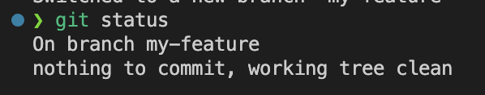

# Push Local Repository

## Table of Contents

- [Push Local Repository](#push-local-repository)
  - [Table of Contents](#table-of-contents)
  - [Overview](#overview)
  - [Procedure](#procedure)

## Overview

Git provides a framework to create multiple features between multiple developers at the same time, but the method by which a project implements git is left very open-ended. This section will provide a method by which "branches" can be created and maintained, as well as how to stage, commit, and push local changes to the remote repository to be merged with other collaborators' work.

This document loosely follows GitHub Flow, one of many version control strategies. More information about GitHub Flow can be found in the [Branching Strategy Guide](Branching%20Strategy.md) or online [here](https://docs.github.com/en/enterprise-server@3.7/get-started/quickstart/github-flow).

## Procedure

1. Get a list of all available branches and current working branch.

    ```shell
    git branch
    ```

2. If you are not on the correct branch, create a new branch.

    ```shell
    # Long way
    git branch -c branch-name
    git checkout branch-name

    # Shorthand way to create and checkout a branch
    git checkout -b branch-name
    ```

    > :bulb: **FAQ**: How do I know if I'm on the right branch?
    >  
    > When [Initializing a Local Repository](Initialize%20a%20Local%20Repository.md), a default branch name of `main` was given. According to the [IA Git Style Guide](https://inductive-git.ia.local/eknorr/git-style-guide.git), it is not recommended to develop on the `main`. If preparing to develop a new feature, consider making a new branch for that feature with a descriptive name.

3. Make edits to files in VSCode or Ignition Designer
   - Now that a working branch has been checked out, edits to files without affecting the main branch or remote repository.

4. Add and commit local changes
   1. After the feature (or portion of feature) has been created, check local repository for any untracked changes

        ```shell
        git status
        ```

   2. Add file(s) to be Tracked

        ```shell
        # Single file
        git add file-name.fileType

        # Multiple files
        git add file-name-1.fileType file-name-2.fileType

        # Add all files
        git add . 
        ```

    > :memo: **Note**: This adds files to the staging area, but doesn't commit them yet. The previous step can be done multiple times until all relevant files are added to the staging area

    > :bulb: **FAQ**: Which files do I add and commit?
    >
    > It's possible that some untracked changes shown in `git status` are not part of a certain commit or feature in general (in the case of a changed resource file that was not actually edited). It is recommended to make commits for one feature or sub-feature at a time. For instance, if a label was added to a view, then a style class was created to be added to that label. It would be recommended to make two commits: one for any style class changes, one for any changes made to that view.

5. Commit changes and add a message

    ```shell
    git commit -m “Added code to files”

    # Shorthand to add and commit 
    git commit && git commit -m “Added code to files”
    ```

6. Verify a clean working tree
   - Once tracked file changes have been committed, it is a good practice to verify a clean working tree (no untracked changes).

    ```shell
    git status
    ```

   - Expected output: 

7. Push the tracked changes to remote repository.

    ```shell
    git push origin HEAD
    ```

    - The `git push` command above takes to arguments:
      - `origin` is the name given to the remote repository when [initializing a remote repository](Initialize%20a%20Local%20Repository.md). Remember that it could be called something different than `origin`.
      - `HEAD` refers to the currently checked-out branch's latest commit. Alternatively, the current branch name could be explicitly called out here.

> :bulb: **FAQ**: What if I forget what I called my remote source?
>
> Run `git remote -v` to see all remote sources
> 

Now that changes have been pushed from the local environment to the remote repository, it's time to merge changes into the remote main so all collaborators have access.

**Next: [Create a Pull Request](Create%20a%20Pull%20Request.md)**
