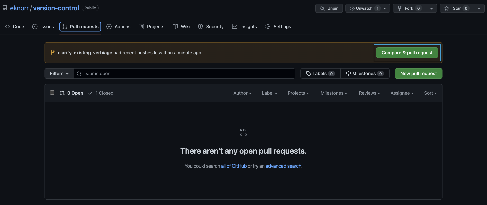

# Create Pull Request
## Table of Contents
- [Overview](#overview)
- [Procedure](#procedure)
## Overview
Pull requests let you tell others about changes you've pushed to a branch in a repository on GitHub. Once a pull request is opened, you can discuss and review the potential changes with collaborators and add follow-up commits before your changes are merged into the base branch. Although it's not strictly necessary to make a pull request, it is recommended to create a pull request before merging each feature.
## Procedure
1. On GitHub Enterprise Server webpage, navigate to the main page of the repository.
2. Select Pull Request tab
   1. If code from a branch was recently pushed, there may be a notification to create a pull request: 
   2. If this banner is not here, follow [these](https://docs.github.com/en/enterprise-server@3.7/pull-requests/collaborating-with-pull-requests/proposing-changes-to-your-work-with-pull-requests/creating-a-pull-request?tool=webui) instructions to find your branch and create a pull request.
3. Add verbiage about the commit(s) you made
   - Header: Sum up feature in a few words
   - Comment: If necessary, add a few sentences or bullet list for added context of this feature.
4. Select Create Pull Request

> :bulb: **FAQ**: What's the difference between a Pull Request and a Merge Request?
>
> Nothing! These are different terms for the same thing created by GitHub (which uses Pull Request) and GitLab (which uses Merge Request). Remember that Git stands on it's own from external tools like GitHub, Gitlab, and Azure DevOps. These external tools are useful for collaboration and have different terms for the same features.

Once a pull request has been made, the code needs to be reviewed by the repository’s code owner to be merged into master branch. 
  - You may the owner, in which case, you could approve the pull request and merge the code, but normally the Lead Engineer(s) on the project will review the code then perform the merge if they determine the code is correct. 

**Next: [Review Changes and Merge to Master](Review%20Changes%20and%20Merge%20to%20Master.md)**