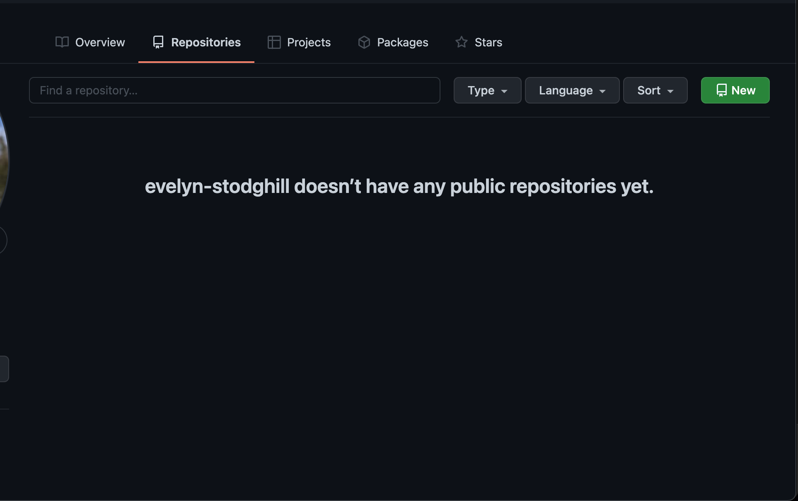
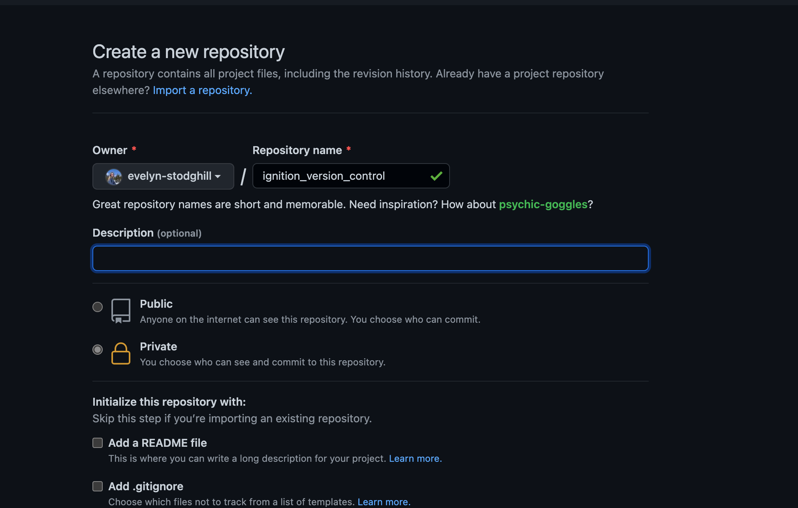

# Ignition Example

## Getting Started

  In order to perform version control on Ignition, the following are suggested:

  ### Required Tools
  - [Ignition](https://inductiveautomation.com/downloads/) must be installed.
  - [Git](https://git-scm.com/downloads) must be installed.

  ### Recommended Tools
  - [Visual Studio Code](https://code.visualstudio.com/Download) must be installed.
  - A [GitHub](https://github.com) account must be made with the proper DG credentials. 


## Initializing Your Repository

The goal of this exercise is to focus on version control and how it works with Ignition. That said, we will set up an Ignition Quick Start project so we have something to add to a repository and version control. It is good to note that while this guide is used with Quick Start, the procedure is the same with a project where Quick Start isn't used. All references to the Quick Start project can be replaced with your project name. 

To begin, set up your Ignition gateway. In this example we will use the built in Quick Start project, however this is not required for all implementations. Once this has been done, it is time to initialize your repository. [Here](https://docs.inductiveautomation.com/display/DOC80/Quick+Start+Guide) is a guide to the Ignition Quick Start if needed. Below includes and image of what is to be expected when first starting the ignition Gateway. Make sure to select "Yes, Enable Quick Start"


- Open VS Code and navigate to the project directory. The path file should look like: `../data/projects/quickstart`
  - This can be done by selecting `File/Open..` and navigating to the Ignition project (The default location is `C://Program Files Inductive Automation/Ignition`)
  - Using the `EXPLORER` tab in VS Code, right click the project and select `Open in Integrated Terminal`.
  - Within the terminal, verify you are in the correct directory by typing the command `pwd` (`P`rint `W`orking `D`irectory). This directory should be within the project name, `samplequickstart`.
    - For Mac the directory should be: `/usr/local/ignition/data/projects/samplequickstart`
    - For Windows the directory should be: `C://Program Files Inductive Automation/Ignition/data/projects/samplequickstart`
- Once there, ensure you are properly logged in to github or your desired remote repo.
  - In the terminal, add these commands with your information. 
  - __Note:__ If you are having trouble with your GitHub credentials, please refer to [this](https://github.com/design-group/version-control) document. 

```
git config --global user.name "YourUserName"
```
```
git config --global user.email "your@email.addr"
```
- Add an ignore file.
  - Within the top level directory of your repository, create a file named `.gitignore`.
  - Add the following to the file.
   ```python
  # Ignition Resource Content
  ./resources/
   ```
   - This will ignore all of Ignition's resource files. While this example is Ignition specific, it is also possible to ignore any other type of file that shouldn't be tracked. You may want to also exclude:
     - `com.inductiveautomation.vision/`: if your project does not use vision, it is not needed.
     - `DS_Store`: if using a Mac, the `DS_Store` file contains your viewing preferences.
     - `*.code-workspace`: This will ignore your workspace files if using VS Code.
     - `.vscode/`: if using VS Code, this will ignore files created by VS Code.
     - `__pycache__/`, `.jython_cache`  and `.pytest_cache`: can be used to ignore caches made by python, jython and pytest.
     - `*.pyc`: will ignore the compiled byte code python files.
  - The intention of this file is to tell git what not to track. In other words, git will **not** keep these files in the repository or track changes made to these files. These files will still exist on the gateway, and will not be removed, just will not be version controlled.
- Save the file.
- Make your repository.
  - In the GitHub web browser, navigate to your profile and select "Repositories". The page should look like this:
  
  - Select the green "New" button in the right hand corner.
  - Decide on what you want to call your repository. Make sure it is relevant to the project. Feel free to set the repository to private.
 
  - Select the "Create repository".
- Now it is time to initialize the repository. Execute the following commands in the terminal:
```sh
git init
git remote add origin <Your version control repository link>
git add .
git commit -m "Initial commit"
git push -u origin master
```

## About the Commands
- `git init`: 
  - `init` initializes the repository.
- `git remote add origin <Repository Link>`: 
  - `remote add` refers to adding a location where the work is stored. In this case, it is held remotely on GitHub.
  - `origin` is an alias for a particular repository. In this case, the link you have added.
  - `<Repository Link>` is the repository which will be herein referred to as `origin`. The link to your repository is is a combination of the github url, your username (or the organization the repo is made under), and the name of your repository. In the example, the url is: `https://github.com/evelyn-stodghill/ignition_version_control`.
- `git add .`:
  - `add .` adds the work you have done in the current directory to the staging area. Because the repository has no previous commits, this will be many Ignition files. The `.` is used to denote the entire contents of the directory you are working in.
- `git commit -m "Initial commit"`:
  - `commit` is the command for committing your work. A commit is good to do regularly, it allows for going back to the exact state of your work at the time of the commit.
  - `-m "Initial commit"` adds a message to the commit. In this case, the message is "Initial commit". It is important to be specific when writing the messages as it becomes difficult to remember what each commit was for and can be confusing if there was ever a need to rollback to a specific commit.
  - Without the `-m` it will open a text editor with a file that you can type the message into.
- `git push origin master` allows for pushing all of the commits to the remote master.


- You have just made your GitHub repository. To verify, you can go to your GitHub account and see the new repository. Below is what should be visible on Github:


## Developing a New Feature
Now that the repository has been initialized, it's time to add a new feature. To add and version control the new feature, follow the directions below.

- Create a new branch by typing this in the terminal: ```git checkout -b new_feature```.
  - The `checkout` command allows for navigating to a branch. This command can also be used switching to another branch. For example, to get to the master branch the command is ```git checkout master```.
  - The ```-b``` stands for branch. This creates the new branch.
  - ```new_feature``` is the name of your branch. 

- Open the Ignition Designer and make a new view called `example_view`.
  

- Edit the background color, for this example the background has been changed to red.
  
- Once your new feature has been added, save in the Ignition Designer and return to your terminal.
- To see what you have edited, use the command `git status`. This will show you the status of all your work within the branch.
  - You should see a few files modified specifically in `com.inductiveautomation.perspective`. 


- We now need to add these changes to the remote repository. Start with this command `git commit -am "Added cool new feature"`. 
  - This is the `commit` command which we have done before but with the additional `-am`. The `a` stands for add. It removes the need for the `git add .` command we did earlier. The `m` stands for message.

- Use the command `git push origin HEAD` to push these changes in the commit to your remote repo. You should see in the terminal a new branch was created.
  - `HEAD` is the current branch. This command in full is to push to the remote branch, `new_feature`.

  - You should be pushing to your remote branch anytime you are done working on the branch, whether you are going to work on a different branch or are done working for the day. This allows other people to pick up where you left off without the chance of doubling up on work.

## How to Submit a Pull Request

Pull requests are used when you want to add your code into the master branch. This allows for a review of your work and to get the team on board with the changes that are about to be added. To put in a pull request perform the below steps.

- Push your latest changes to the remote branch.
- Go to the `Pull requests` tab within GitHub.

- Select `New pull request`
- Select the branch you want to add your code to. This is usually the master branch. Then select the name of your branch. We should see an arrow pointing from `new_feature` to `master`.
- 
- Add a short description containing the purpose of the pull request. This will allow your reviewers to know what the purpose of the request is.
- Select the drop down on the green button that says `Create Pull Request` and select `Create Draft Pull Request`.
  - It is good practice to make a draft pull request first because it allows for you to review the changes you want to pull into the other branch. Make sure the pull request only has the changes directly relating to the branch. In other words, do not try to merge code involving the renaming of a variable when the branch is intended for only merging documentation.

- **Common Errors:** The goal of the pull request is to only have intended changes present. This means there should not be a change in the files that you did not alter. The only exception to this are the `resource.json` files.
  - **Unneeded File:** Sometimes Git will pick up a file that is not needed. For example, binary files. It is best to remove them while your file is still a draft. To do so, use the command ```git rm --cached file_name```.
    - ```rm``` stands for "remove". `cached` removes the file from the staging area. This means it will not be included in both the commit or the push. 
  - **Merge Conflict:** Sometimes when trying to merge, there will be a conflict. This is because what is in the current branch and master are not the same. In order to choose which version you want, use this command: ```git pull origin branch_to_merge_with```. For example, ```git pull origin master``` will pull in all content from the master.
    - From here search the project for the characters ">>". This will show all conflicts. For every conflict, select whether you wand the HEAD or incoming version, save, and commit.
    - Push your code out with these newly resolved conflicts and look at GitHub to verify there are no more conflicts. 
  - **Missing File:** Sometimes you will accidentally delete a file you disn't mean to. To fix this, use the following command: ```git checkout origin/branch_to_merge_with path/to/deleted/file```. For example, ```git checkout origin/master ignition/script-python/Example/code.py``` will add back the master's version of `Example/code.py`.
  - **Reset to Previous Commit:** In the case you want to go back to a previous commit, find the commit you whish to go back to. Then use this command ```git reset <commit id>```. This would look something like: ```git reset e0b5ab11f1eeac6116b5a7abf4cbdf9b12f26990```. The commit id can be found by clicking the "commit" link in the right hand corner of the GitHub branch that would contain your commit.

- Once everything is in order, select "Ready for review". You will now have a pull request.
- Some pull requests will require a certain amount of reviews to merge into a branch. To do this, Select the gear in the right hand column next to "Reviewers." Select the people most appropriate for the review. They will be notified their review was requested.
  - 

## Additional Resources

[Inductive Automation's Version Control Guide](https://www.inductiveautomation.com/resources/article/ignition-8-deployment-best-practices#gitlab-example)

[Design Group's Version Control Guide](https://github.com/design-group/version-control)

[My Example](https://github.com/evelyn-stodghill/ignition_version_control)