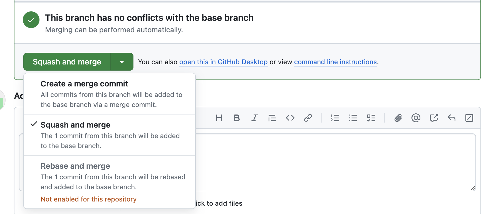

# Merge Pull Request

## Table of Contents

- [Merge Pull Request](#merge-pull-request)
  - [Table of Contents](#table-of-contents)
  - [Overview](#overview)
  - [Procedure](#procedure)

## Overview

When the pull request is ready to merge, any conflicts with the destination branch have been resolved, and approvals (if required) have been obtained, select the merge strategy and merge the PR as described below.

## Procedure

1. Verify the PR is ready to merge

    On the pull request page, scroll down to the section that shows the status of the pull request.

    - If approvals are required, make sure the PR is approved. Prior approval may have gone stale if changes were made since it was received. If that's the case, request another review / approval.

    - If there are any conflicts with the destination branch, merge will be blocked until conflicts are resolved. 

      > To resolve conflicts, merge the latest changes from the remote destination branch into your local branch and push the local branch to the remote. The PR made from that branch will be automatically updated with the latest changes.

2. Select merge strategy and complete the merge

   There are three ways to merge a PR: 

   

   - Create a merge commit

      This will add all of the commits from the PR's source branch, plus the additional merge commit. 
      While this is the simplest way to merge PRs, it can create a lot of clutter on the destination branch, and make it harder to tell what the purpose of the specific PR was

   - Squash and merge (recommended)

     This method combines all of the commits in the PR into a single commit. You will be prompted to provide the title and an optional description for this new single commit. By default, the title will be the PR's title with the PR number. 
       1. Edit the title if desired

          By default, the title of the squash-and-merge commit is comprised ofthe PR title and number. You can edit it for clarity if needed, but it is not a good idea to remove or edit the PR number part. 

       2. Edit the description
        
          The description will by default contain all the commit messages from all the commits in the PR. Although this can be left as-is, it is a good idea to remove any irrelevant messages and only provide the high-level details relevant to the whole PR

        3. Click the "Confirm squash and merge" button. 
        
           This will complete the merge.

   - Rebase and merge
    
      This is an avanced merge method that is currently not recommended for SE repos, and may be disabled. More more infortmation on rebasing, see [here](https://git-scm.com/docs/git-rebase).

    Result of using  a merge commit vs squash-and-merge in the history of the destination branch:

      
