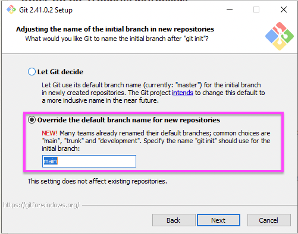
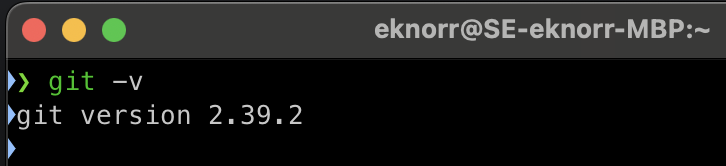
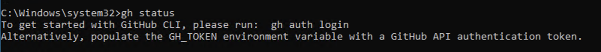
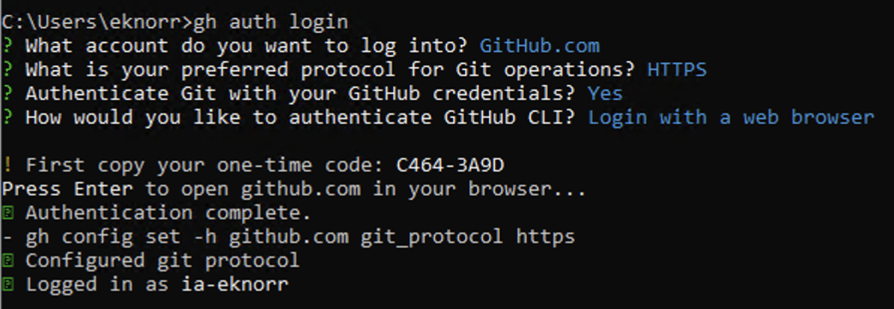

# Workstation Setup

Before getting started with version control, you will need to set up your workstation with the necessary software. There are many ways to use version control with Ignition, and as you grow in your knowledge of version control, you may find something that works better for you. Below are recommendations to get you started. These are tried and true in the industry, so it will be a great starting point.

## Table of Contents

- [Workstation Setup](#workstation-setup)
  - [Table of Contents](#table-of-contents)
  - [Required Software](#required-software)
    - [Visual Studio Code](#visual-studio-code)
      - [Installation](#installation)
      - [Configuration](#configuration)
    - [Git](#git)
      - [Download](#download)
      - [Installation](#installation-1)
      - [Configuration](#configuration-1)
    - [Github CLI](#github-cli)
      - [Download](#download-1)
      - [Installation](#installation-2)
      - [Configuration](#configuration-2)

## Required Software

### Visual Studio Code

One of the most widely used Integrated Development Environments (IDE). While there are many other IDEs to choose from, each with their individual pros and cons, this guide will use VS Code.

- [Downloads Page](https://code.visualstudio.com/download)

#### Installation

- Run the installation wizard

#### Configuration

Although no additional configuration is required for VS Code, there are several [Extensions](https://marketplace.visualstudio.com/vscode) that provide significant quality of life improvements in VS Code. Below is a list that you might find useful:

- [Python](https://marketplace.visualstudio.com/items?itemName=ms-python.python)
- [Pylance](https://marketplace.visualstudio.com/items?itemName=ms-python.vscode-pylance)
- [Docker](https://marketplace.visualstudio.com/items?itemName=ms-azuretools.vscode-docker)
- [MongoDB](https://marketplace.visualstudio.com/items?itemName=mongodb.mongodb-vscode)
- [Git Extension Pack](https://marketplace.visualstudio.com/items?itemName=donjayamanne.git-extension-pack)
- [Vim](https://marketplace.visualstudio.com/items?itemName=vscodevim.vim) - If you're into that sort of thing
- [SQLTools](https://marketplace.visualstudio.com/items?itemName=mtxr.sqltools)
- [Remote - SSH](https://marketplace.visualstudio.com/items?itemName=ms-vscode-remote.remote-ssh)
- [Markdownlint](https://marketplace.visualstudio.com/items?itemName=DavidAnson.vscode-markdownlint)
- [Code Spell checker](https://marketplace.visualstudio.com/items?itemName=streetsidesoftware.code-spell-checker)

### Git

Although other version control software exists, this is IA's preferred version control system. If given the option, the latest stable release of git will work for our use case.

#### Download

- MacOS (Homebrew)

  ```shell
  brew install git
  ```

- Windows (Winget)

  ```shell
  winget install --id Git.Git --override ""
  ```

- [Direct Download](https://git-scm.com/download/win)

> [!TIP] What is Homebrew? What is Winget?
>
> Winget and Homebrew are package managers designed for different operating systems. Winget is the official package manager for Windows, providing a command-line interface to install, manage, and update software packages on Windows 10 and later versions. Homebrew, on the other hand, is a package manager for macOS and Linux, allowing users to easily install and manage a wide range of software packages through a command-line interface and a formula system. Both package managers simplify the process of installing and managing software, providing centralized repositories and handling package dependencies to ensure a streamlined experience for users.

> [!TIP] What if I don't have these package managers?
>
> Winget comes pre-installed on Windows, but Homebrew (for MacOS/Linux) needs to be installed separately
>
> For Windows:
>
> - Check if you have winget by running `winget -v` on Command Prompt. If it doesn't return a version number, then try the direct download link given above.
>
> For MacOS:
>
> - Run the following command in a terminal window: `curl -fsSL https://raw.githubusercontent.com/Homebrew/install/HEAD/install.sh`

#### Installation

- Run installation wizard
- Override the default branch name for new repositories to "main"
  - The historically used default branch of "master" has fallen out of favor in recent years, opting instead for "main", "trunk", or "stable"

 

- All other install sections can be left as default

#### Configuration

1. Open a CLI (such as Terminal or Command Prompt)
   - After installation, you may need to open a new terminal window for installation to be recognized.
2. Verify that git was installed properly

    ```shell
    git -v
    ```

    
   - If a git version number is not returned, check that the installation has finished, or try uninstalling and reinstalling using the procedure in the previous section.
   - Git version 2.35.0 or later is recommended

3. Configure username and email
   - This is the email and name that will be shown on your commits and pull requests.

    ```shell
    git config --global user.name “your username”
    git config -–global user.email “your email”
    ```

4. Verify email and username was configured correctly

    ```shell
    git config --global user.name
    git config -–global user.email
    ```

### Github CLI

#### Download

- MacOS (Homebrew)

  ```shell
  brew install gh
  ```

- Windows(Winget)

  ```shell
  winget install -e --id GitHub.cli
  ```

  - [Direct Download](https://cli.github.com)

#### Installation

- Run installation wizard
- No custom install settings are needed - use defaults

#### Configuration

1. Open a CLI (such as Terminal or Command Prompt)
   - After installation, you may need to open a new terminal window for installation to be recognized.
2. Verify that Github CLI was installed properly

    ```shell
    gh status
    ```

    
   - If a message instructing you to run `gh auth login` doesn't show, check that the installation has finished, or try uninstalling and reinstalling using the procedure in the previous section
3. Authenticate with a GitHub Host

    ```shell
    gh auth login
    ```
  
   - Follow the prompts to log in to Github.
   - There are multiple ways to authenticate - one example is provided below.

    

More information about the setup process can be found [here](https://docs.github.com/en/get-started/quickstart/set-up-git).

Now your workstation is connected to GitHub!

---

**Next: [Initialize a Local Repository](Initialize%20a%20Local%20Repository.md)**
